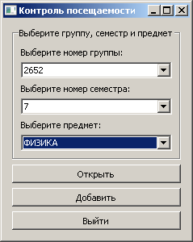
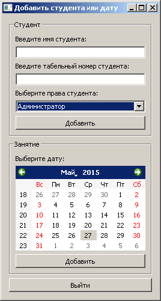

## «Агент посещаемости занятий» — ведение журнала посещаемости занятий

Основные функции | Скриншот
---|---
При открытии программа предлагает: 1) выбрать группу, семестр, предмет для перехода к окну со статистикой посещений; 2) перейти к окну добавления новых групп, семестров, предметов (требуются права преподавателя); 3) выйти из программы | 
В окне со статистикой посещений выводится таблица с именами студентов, датами занятий и отметками посещаемости. | 
Через меню окна осуществляется доступ к работе с программой. Доступ к пунктам возможен так же и по «горячим клавишам»: например, «Ctrl»+«G» для перехода к стартовому окну. | 
Окно с вводом табельного номера для идентификации пользователя | 
Окно добавления студентов, даты занятий. | 
Окно мульти-редактирования посещаемости. | 
Окно добавления новых групп, семестров, предметов. | 
Информирование об успешности операций | 

###Обработка ошибок
Программа имеет возможность обрабатывать различного рода ошибки, возникающие во время работы, и выводить их описание пользователю.

Ошибка | Скриншот
---|---
Пользователь не ввёл все данные в поля | 
Не сделан выбор предложенных значений | 
Ввод ошибочных данных | 
Предупреждение | 

###Требования
* Python 3.4
* PyQT4

### Создатели
* [become-iron](http://github.com/become-iron)
* [Alex1166](http://github.com/Alex1166)
